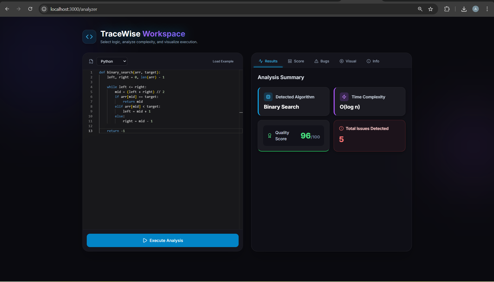
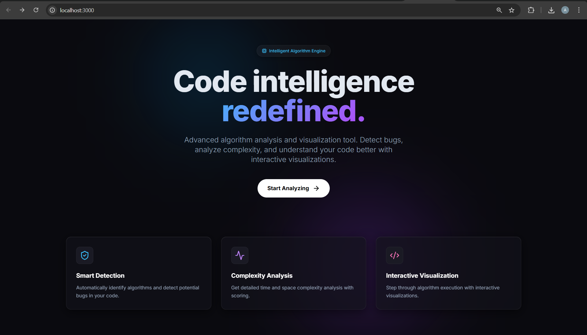
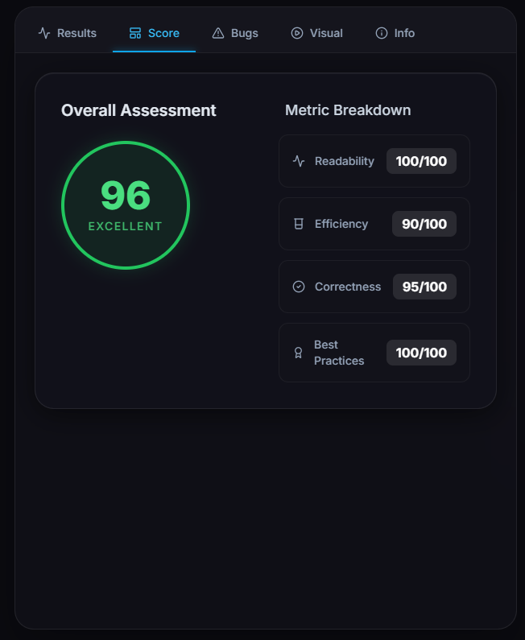
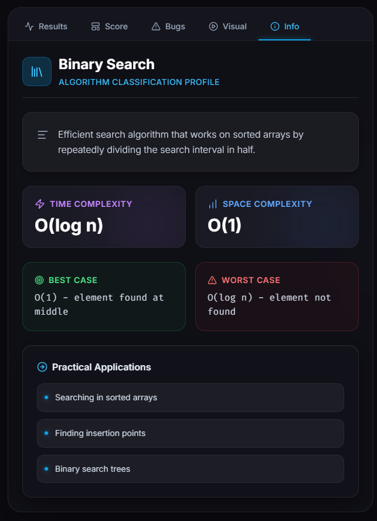
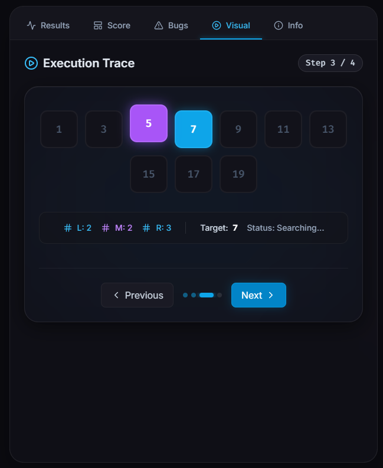
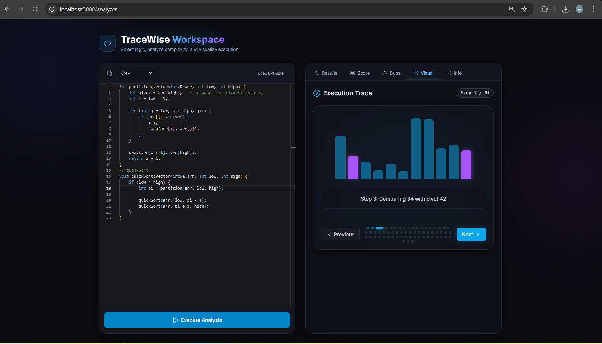
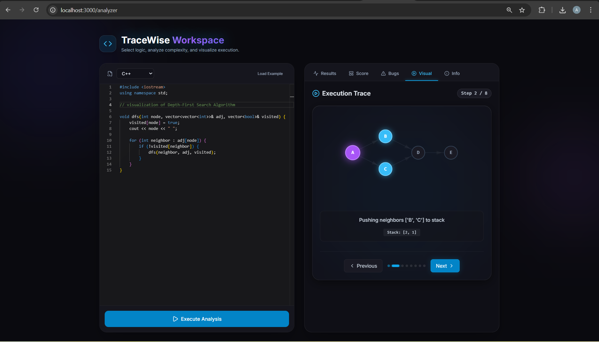

# TraceWise - Intelligent Bug Evaluation And Algorithm Visualization

**Built for the CodeWiser Hackathon! 🏆**

Advanced algorithm analysis and visualization tool that helps developers understand, debug, and optimize their code through intelligent analysis and interactive visualizations.

## 🎥 Visual Showcase

<p align="center">
  <em>(Demo Video Placeholder)</em><br/>
  <b><a href="#">▶️ Watch Full Demo</a></b>
</p>

---

### 💻 Intelligent Workspace
Write, execute, and analyze algorithms dynamically using our custom React-Monaco integrations. We seamlessly parse and execute **Python**, **JavaScript**, and **C++** on the backend.

| Code Editor & Terminal | Analysis Results & Dashboard |
| :---: | :---: |
|  |  |

### 📊 Metrics & Intelligence
Instantly receive precise component scorings identifying Big-O runtimes, syntax weaknesses, and unoptimized loops.

| Metric Breakdown | Algorithm Identification |
| :---: | :---: |
|  |  |

### 🌌 Dynamic Visualizers
Visualizations transform abstract arrays and graphs into gorgeous, step-by-step framer-motion animations.

| Binary Search Trace |
| :---: |
|  |

| Array Sorting Visuals | Graph Path Traversals (DFS/BFS) |
| :---: | :---: |
|  |  |

---

## 🚀 Features

### 🔍 Smart Code Analysis
- **Algorithm Detection**: Automatically identify algorithms from your code
- **Bug Detection**: Find potential bugs and issues using static analysis
- **Complexity Analysis**: Estimate time and space complexity
- **Quality Scoring**: Get comprehensive code quality metrics

### 📊 Interactive Visualizations
- **Step-by-Step Execution**: Visualize algorithm execution step by step
- **Binary Search**: See how binary search narrows down the search space
- **Sorting Algorithms**: Watch sorting algorithms in action
- **Graph Algorithms**: Visualize graph traversals and pathfinding

### 🎯 Comprehensive Reports
- **Detailed Analysis**: Get in-depth analysis of your code
- **Executive Summaries**: High-level overview for stakeholders
- **Improvement Recommendations**: Actionable suggestions to improve code quality
- **Performance Metrics**: Detailed performance analysis

### 🛠️ Supported Languages
- **Python** (3.8+)
- **JavaScript** (ES6+)
- **C++** (C++17)

## 📁 Project Structure

```
TraceWise/
├── frontend/                 # React frontend application
│   ├── public/
│   │   └── index.html
│   ├── src/
│   │   ├── components/      # React components
│   │   ├── pages/          # Page components
│   │   ├── services/       # API services
│   │   ├── utils/          # Utility functions
│   │   ├── App.jsx
│   │   └── main.jsx
│   ├── package.json
│   ├── tailwind.config.js
│   └── vite.config.js
├── backend/                 # FastAPI backend application
│   ├── app/
│   │   ├── main.py         # Main application entry point
│   │   ├── config.py       # Configuration settings
│   │   ├── routes/         # API routes
│   │   ├── parser/         # Code parsing module
│   │   ├── detector/       # Algorithm detection module
│   │   ├── analyzer/       # Code analysis module
│   │   ├── executor/       # Code execution module
│   │   ├── visualization/  # Visualization module
│   │   ├── report/         # Report generation module
│   │   └── utils/          # Utility functions
│   ├── test_cases/         # Test case definitions
│   ├── sandbox/           # Code execution sandbox
│   ├── requirements.txt
│   └── server.py           # Backend startup script
├── shared/                 # Shared constants and schemas
│   ├── schemas/           # JSON schemas for API
│   └── constants/         # Shared constants
└── README.md
```

## 🚀 Quick Start

### Prerequisites

- Node.js 16+ (for frontend)
- Python 3.8+ (for backend)
- npm or yarn (for frontend dependencies)

### Installation

1. **Clone the repository**
   ```bash
   git clone <repository-url>
   cd TraceWise
   ```

2. **Set up the backend**
   ```bash
   cd backend
   python3 -m venv venv
   source venv/bin/activate  # On Windows: venv\Scripts\activate
   pip install -r requirements.txt
   ```

3. **Set up the frontend**
   ```bash
   cd frontend
   npm install
   ```

### Running the Application

1. **Start the backend server**
   ```bash
   cd backend
   python server.py
   # Or using uvicorn directly:
   # source venv/bin/activate (or venv\Scripts\activate on Windows)
   # uvicorn app.main:app --host 0.0.0.0 --port 8000 --reload
   ```

2. **Start the frontend development server**
   ```bash
   cd frontend
   npm run dev
   ```

3. **Access the application**
   - Frontend: http://localhost:3000
   - Backend API: http://localhost:8000
   - API Documentation: http://localhost:8000/docs

## 📖 Usage

### Analyzing Code

1. **Open the Analyzer page** in the web application
2. **Select your programming language** (Python, JavaScript, or C++)
3. **Paste your code** in the code editor
4. **Click "Analyze Code"** to get comprehensive analysis

### Understanding Results

The analysis provides:
- **Algorithm Detection**: Identifies the algorithm used
- **Quality Score**: Overall code quality rating (0-100)
- **Bug Reports**: Detailed list of potential issues
- **Complexity Analysis**: Time and space complexity estimates
- **Visualizations**: Interactive step-by-step algorithm execution

### Using Visualizations

1. **Go to the "Visualization" tab** after analysis
2. **Navigate through steps** using Previous/Next buttons
3. **Watch the algorithm** execute step by step
4. **Understand the logic** through visual representations

## 🔧 Configuration

### Backend Configuration

Edit `backend/app/config.py` to modify:
- Server settings (host, port, debug mode)
- CORS settings
- Execution timeout
- File paths

### Frontend Configuration

Edit `frontend/src/services/api.js` to modify:
- API endpoint URL
- Request timeout settings

## 🧪 Testing

### Backend Tests

```bash
cd backend
python -m pytest tests/
```

### Frontend Tests

```bash
cd frontend
npm test
```

### Integration Tests

```bash
# Run both backend and frontend
# Then run integration tests
npm run test:integration
```

## 📊 API Documentation

The backend provides a comprehensive REST API with the following endpoints:

### Code Analysis
- `POST /api/analyze` - Analyze code for bugs, quality, and algorithms
- `GET /api/languages` - Get supported programming languages

### Code Execution
- `POST /api/execute` - Execute code with test cases

### Visualization
- `GET /api/visualize/{algorithm}` - Get algorithm visualization data

For detailed API documentation, visit http://localhost:8000/docs

## 🎨 Customization

### Adding New Algorithms

1. **Add detection patterns** in `backend/app/detector/algorithm_detector.py`
2. **Create visualization** in `backend/app/visualization/`
3. **Add test cases** in `backend/test_cases/`
4. **Update constants** in `shared/constants/algorithm_types.py`

### Adding New Languages

1. **Add parser support** in `backend/app/parser/`
2. **Add execution support** in `backend/app/executor/`
3. **Update language constants** in `shared/constants/algorithm_types.py`
4. **Add frontend editor support** in `frontend/src/components/CodeEditor.jsx`

## 🤝 Contributing

We welcome contributions! Please follow these steps:

1. **Fork the repository**
2. **Create a feature branch** (`git checkout -b feature/amazing-feature`)
3. **Commit your changes** (`git commit -m 'Add amazing feature'`)
4. **Push to the branch** (`git push origin feature/amazing-feature`)
5. **Open a Pull Request**

### Development Guidelines

- Follow the existing code style
- Add tests for new features
- Update documentation
- Ensure all tests pass

## 📝 License

This project is licensed under the MIT License - see the LICENSE file for details.

## 🙋‍♂️ Support

If you have any questions or issues:

1. **Check the documentation** in this README
2. **Browse the API docs** at http://localhost:8000/docs
3. **Create an issue** on GitHub
4. **Contact the development team**

## 🔮 Roadmap

### Upcoming Features

- [ ] **More Algorithms**: Support for additional algorithms
- [ ] **Real-time Collaboration**: Multi-user code analysis
- [ ] **Code Suggestions**: AI-powered code improvement suggestions
- [ ] **Performance Profiling**: Advanced performance analysis
- [ ] **Integration**: IDE plugins and extensions
- [ ] **Cloud Deployment**: Cloud-based analysis service

### Version History

- **v1.0.0** - Initial release with core features
- **v1.1.0** - Added C++ support
- **v1.2.0** - Enhanced visualization features
- **v1.3.0** - Improved bug detection algorithms

## 📊 Performance

The application is designed to handle:
- **Code files up to 10,000 characters**
- **Analysis in under 5 seconds** for typical code
- **Concurrent analysis** for multiple users
- **Large datasets** for visualization (up to 1000 elements)

## 🔒 Security

- **Sandboxed execution** for user code
- **Input validation** and sanitization
- **Rate limiting** for API endpoints
- **No persistent storage** of user code

## 📈 Metrics

The system tracks:
- **Analysis accuracy** through test cases
- **Performance metrics** for optimization
- **User feedback** for continuous improvement
- **Error rates** for reliability monitoring

---

**TraceWise** - Making algorithm analysis and visualization accessible to everyone! 🚀

## 👥 Meet the Team
- **Aryan Doshi** - [aryan-2206](https://github.com/aryan-2206)
- **Indraneel Hajarnis** - [Indraneel-Hajarnis](https://github.com/Indraneel-Hajarnis)
- **Dhairya Dabi** - [Dhairya211206](https://github.com/Dhairya211206)
